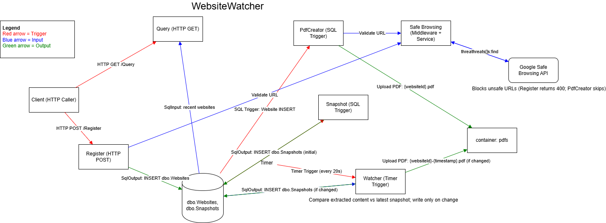

# WebsiteWatcher
Overview

WebsiteWatcher is an event-driven website monitoring system built using Azure Functions (.NET 8 – isolated worker).
It allows users to register websites for monitoring, captures structured snapshots of page content, detects changes over time, and generates immutable PDF artifacts when changes occur, all while enforcing URL safety via Google Safe Browsing.

The system is intentionally designed to showcase:

- Serverless, trigger-based orchestration

- Data-driven workflows using SQL Change Tracking

- Separation of concerns between ingestion, processing, and monitoring

- Security gates integrated directly into execution paths

- Auditability through historical snapshots and stored artifacts

# System Architecture

At a high level, the architecture consists of:

- HTTP-triggered functions for user interaction

- SQL-triggered functions that react to persisted state changes

- Timer-triggered background processing for continuous monitoring

- SQL Database as the single source of truth

- Blob Storage for durable PDF artifacts

- External threat intelligence via Google Safe Browsing

The system is event-driven, not request-chained.
Functions do not directly call each other, they react to events and state changes, which improves decoupling and scalability.

 

This diagram visualizes how Azure Functions bindings drive the system end-to-end:

- Red (Trigger): what invokes a function (HTTP request, SQL change tracking event, or timer tick)

- Blue (Input): what a function reads from (SQL input bindings, Safe Browsing requests)

- Green (Output): what a function writes to (SQL output bindings, Blob uploads)

At the center is the SQL Database (dbo.Websites, dbo.Snapshots) acting as the system-of-record and the event source for SQL-triggered fan-out:

- A successful Register inserts into dbo.Websites

- That insert automatically triggers Snapshot and PdfCreator (fan-out pattern)

- Watcher runs on a timer, compares current extracted content to the latest snapshot, and only writes new snapshots / PDFs when a change is detected

- Safe Browsing is enforced as a security gate during registration and before PDF rendering to prevent unsafe URLs from being persisted or processed

# Core Components and Responsibilities

1. Client (HTTP Caller)

	 The client interacts with the system exclusively through HTTP endpoints:
	
	- POST /Register — register a website for monitoring
	
	- GET /Query — retrieve recently updated websites
	
	The client has no knowledge of downstream processing, which is entirely serverless and asynchronous.


2. Register Function (HTTP POST)

	Purpose:
	Persist a new website registration into the system.
	
	Under the hood:
	
	- Receives an HTTP POST request containing a URL (and optional XPath expression).
	
	- Executes Safe Browsing validation before any persistence occurs.
	
	- If the URL is unsafe:
	
		- Returns HTTP 400
	
		- No database writes occur
	
	- If the URL is safe:
	
		- Writes a new row into dbo.Websites using a SQL output binding
	
		- Returns a successful HTTP response
	
	Key architectural decision:
	The Register function does not trigger snapshots or PDFs directly.
	Instead, it relies on SQL Change Tracking to fan out downstream processing.
	
3. Query Function (HTTP GET)

	Purpose:
	Provide read-only visibility into recently updated websites.
	
	Under the hood:
	
	- Uses a SQL input binding
	
	- Queries dbo.Websites joined with the most recent snapshot timestamp
	
	- Returns results without mutating system state
	
	Why this matters:
	This function demonstrates read-only serverless access patterns and keeps query logic isolated from processing pipelines.

4. SQL Database (dbo.Websites, dbo.Snapshots)

	The SQL Database acts as the central state store and event source.
	
	dbo.Websites
	
	- Stores registered websites and configuration
	
	- Each insert represents a new monitoring intent
	
	dbo.Snapshots
	
	- Stores extracted page content over time
	
	- Uses a composite key (WebsiteId, Timestamp)
	
	- Enables full historical change tracking
	
	Critical design choice:
	SQL Change Tracking is enabled so inserts into dbo.Websites become events, not just stored data.

5. Snapshot Function (SQL Trigger)

	Purpose:
	Capture the initial content snapshot when a website is registered.
	
	Trigger:
	
	- SQL Change Tracking on dbo.Websites (INSERT)
	
	Under the hood:
	
	- Triggered automatically when a new website row is inserted.
	
	- Fetches the website HTML.
	
	- Extracts relevant content using XPath (if provided).
	
	- Writes the extracted content into dbo.Snapshots.
	
	This function establishes the baseline snapshot against which all future changes are compared.

6. PdfCreator Function (SQL Trigger)

	Purpose:
	Generate a PDF artifact for a newly registered website.
	
	Trigger:
	
	- SQL Change Tracking on dbo.Websites (INSERT)
	
	Under the hood:
	
	- Triggered by the same insert event as Snapshot (fan-out pattern).
	
	- Validates the URL again via Safe Browsing (defense-in-depth).
	
	- Uses a headless browser (PuppeteerSharp) to render the page.
	
	- Uploads the generated PDF to Blob Storage.
	
	Important detail:
	If Safe Browsing detects a threat:
	
	- PDF generation is skipped
	
	- The system continues safely without partial artifacts

7. Watcher Function (Timer Trigger)

	Purpose:
	Continuously monitor registered websites for content changes.
	
	Trigger:
	
	- Timer trigger (e.g., every 20 seconds)
	
	Under the hood:
	
	- Reads all websites and their latest snapshot via SQL input binding.
	
	- Fetches current website content.
	
	- Extracts content using the same XPath logic.
	
	- Compares current content against the most recent snapshot.
	
	Only if content has changed:
	
	- Inserts a new snapshot into dbo.Snapshots
	
	- Generates and uploads a timestamped PDF to Blob Storage
	
	Why this matters:
	This function demonstrates:
	
	- Conditional serverless processing
	
	- Idempotent change detection
	
	- Efficient avoidance of unnecessary writes and artifacts

8. Safe Browsing (Middleware + Service)

	Purpose:
	- Act as a security boundary for the system.
	
	Where it is enforced:
	
	- During website registration
	
	- Before PDF generation
	
	Under the hood:
	
	- Integrates with Google Safe Browsing API
	
	- Detects malware, phishing, and unsafe URLs
	
	- Prevents persistence or rendering of unsafe resources
	
	This ensures the system is secure by default, not as an afterthought.

9. Blob Storage (PDF Artifacts)

	Purpose:
	- Store immutable, auditable PDF artifacts.
	
	Behavior:
	
	- Initial registration: {websiteId}.pdf
	
	- Content change: {websiteId}-{timestamp}.pdf
	
	Blob Storage acts as the artifact sink, separate from operational data.
	
	# Architectural Characteristics
	
	Event-Driven
	
	- Functions react to state changes, not direct calls
	
	- SQL acts as both data store and event source
	
	Loosely Coupled
	
	- No function directly invokes another
	
	- Each function has a single responsibility
	
	Auditable by Design
	
	- Full snapshot history preserved
	
	- PDFs provide non-repudiable evidence of page state
	
	Secure by Default
	
	- Unsafe URLs are blocked early
	
	- Defense-in-depth validation is applied
	
	Serverless & Scalable
	
	- No infrastructure management
	
	- Automatic scaling based on triggers

# Local Installation & Setup Guide

Prerequisites

Ensure the following are installed on your machine:

- Required

	- .NET SDK 8.0+  https://dotnet.microsoft.com/download
	
	- Azure Functions Core Tools v4 https://learn.microsoft.com/azure/azure-functions/functions-run-local
	
	- SQL Server (LocalDB or SQL Server Express) https://learn.microsoft.com/sql/database-engine/install-windows
	
	- Azurite (Azure Blob Storage emulator) https://learn.microsoft.com/azure/storage/common/storage-use-azurite
	
	- Node.js 18+ (required for Puppeteer / Chromium) https://nodejs.org

- Optional (recommended)

	- Azure Data Studio or SQL Server Management Studio (SSMS)
	
	- Visual Studio 2022 or VS Code

 
**Step 1: Clone the Repository**
```
git clone https://github.com/<your-username>/WebsiteWatcher.git
cd WebsiteWatcher

```
**Step 2: Configure Local Settings**

Create a local.settings.json file in the project root (or update the existing one):

```
{
  "IsEncrypted": false,
  "Values": {
    "AzureWebJobsStorage": "UseDevelopmentStorage=true",
    "FUNCTIONS_WORKER_RUNTIME": "dotnet-isolated",
    "GoogleSafeBrowsingApiKey": "<YOUR_GOOGLE_SAFE_BROWSING_API_KEY>"
  },
  "ConnectionStrings": {
    "WebsiteWatcher": "Server=(localdb)\\MSSQLLocalDB;Database=WebsiteWatcher;Trusted_Connection=True;"
  }
}
```
Notes

- AzureWebJobsStorage uses Azurite

- WebsiteWatcher connection string points to LocalDB

- You must supply a valid Google Safe Browsing API key

**Step 3: Set Up the Database**

- Create a new database called WebsiteWatcher

- Execute the SQL script:
```
Sql/create-complete-db-setup.sql
```
This script:

- Creates dbo.Websites and dbo.Snapshots

- Enables SQL Change Tracking

- Sets required keys and defaults

**Step 4: Start Azurite (Blob Storage Emulator)**

If using Azurite via command line:
```
azurite
```
Or start it from VS Code if installed as an extension.

This provides:

- Blob Storage endpoint

- Local container support (pdfs will be created automatically)

**Step 5: Restore Dependencies**
```
dotnet restore
```
On first run, PuppeteerSharp will download a compatible Chromium build automatically.

**Step 6: Run the Azure Functions App**

```
func start
```

**Step 7: Test the System**

Register a Website
```
POST http://localhost:7071/api/Register
Content-Type: application/json

{
  "url": "https://example.com",
  "xPathExpression": "//body"
}
```
Expected behavior:

- Unsafe URLs return 400

- Safe URLs insert into dbo.Websites

- Initial snapshot and PDF are generated automatically

Query Recent Websites

```
GET http://localhost:7071/api/Query

```
Returns websites with recent snapshots.
